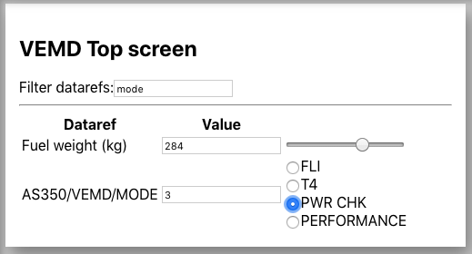

# Flight-Connect Javascript API

The Flight-Connect Javascript API is the client side code that handles your connection to X-Plane. It allows you to subscribe to datarefs and set datarefs.

# AppConnection
The AppConnection object contains your connection to X-Plane and manages the communications.

Note: functions marked with a '†' require Flight-Connect Plus

### Methods
* <a href="#constructor">constructor</a>
* <a href="#datarefSubscribe">datarefSubscribe</a>
* <a href="#setDataref">setDataref</a>
* <a href="#setArrayDataref">setArrayDataref</a>
* <a href="#runCommand">runCommand</a>
* <a href="#moveToAirport"> moveToAirport </a>

<a name="constructor"></a>
## new AppConnection(host, metadata, callback)

The three parameters are as follows. An example will be given at the end.

**Host:** For ease of configuration, you should enter the global variable ```__configuredHost``` which is defined in ```host.js``` (which must be included in your HTML file before ```client.js```). This is the IP address of the computer running X-Plane. By using this variable you can change the connection IP of all your instruments in one place, handy if you have many instruments. Of course, you can specify this as a string or other variable if you wish.

**NOTE:** An incorrectly set `__configuredHost` can cause problems when loading instruments on other devices. For best results in this situation, set __configuredHost to `'auto'`. [More details]()

**Metadata:** The metadata object contains information about the instrument you are creating, such as its name. Adding metadata can allow you to customise certian ways you can test your instrument in the Flight-Connect application. For example to add a more descriptave alias for a dataref. For more information see: <a href="#metadata_object">AppConnection metadata</a>

**Callback:** Once the connection is established, the callback is executed in which you can register your subscriptions.

### Example
```javascript
new AppConnection(__configuredHost, { name: "Airspeed", identifier: "com.example.airspeed" }, (connection) => {
    
    // Your subscriptions go here
});
```

**More details about __configuredHost**
Auto mode attempts to connect the WebSocket to the same host that is running the HTTP server (ie. Flight-Connect). Flight-Connect can then facilitate the transfer of connections to different hosts it detects are running X-Plane. If the instrument is being served using the `file:` protocol, it will attempt to connect to `localhost`. If you want to connect to a different host, but serve from file, enter that host name as `__configuredHost` instead.

<a name="datarefSubscribe"></a>
## datarefSubscribe(callback, context, ...datrefs)
Use this method to subscribe to datarefs. The function you pass in as a callback will be called with the values of each dataref as the arguments after every frame in X-Plane, as long as the value of at least one of the datarefs has changed since the last cycle.

**For example:** If you subscribe to ```sim/cockpit2/clock_timer/local_time_seconds```, your callback will only be called once a second, because that's how often that dataref changes.

### Parameters
| Argument | Type | Description
| --- | --- | --- |
| callback | ```function(...args)```| The function that will be called when datarefs update. Passed args will be the values of the subscribed datarefs.
| context | ```Object``` | the value of ```this``` inside your callback.  99% of cases you just need to pass ```this```. See: [Function.prototype.apply()](https://developer.mozilla.org/en-US/docs/Web/JavaScript/Reference/Global_Objects/Function/apply) for more details.
| ...datarefs | [String] | As many datarefs as you would like to subscribe to. Should match the number of arguments that your callback recieves.

### Example
```javascript
connection.datarefSubscribe(
    yourCallback, 
    this, 
    "sim/cockpit2/clock_timer/local_time_seconds",
    "sim/cockpit2/clock_timer/local_time_minutes",
    "sim/cockpit2/clock_timer/local_time_hours",
	"sim/time/timer_elapsed_time_sec"
);
```

<a name="setDataref"></a>
## setDataref(dataref, type, value)<sup>†</sup>

Use this function to write a value to a dataref. (The dataref must not be read only)
### Parameters
| Argument | Type | Description
| --- | --- | --- |
| dataref | String | The name of the dataref to write to.|
|type|String|One of ```"INT" | "FLOAT" | "DOUBLE"```|
|value| Number| The value you want to set. Javascript has no concept of ints, floats or doubles, the conversion is automatic and you don't need to worry about it.

### Examples
```
connection.setDataref("example_writable_float_dataref", "FLOAT",  2.718);

connection.setDataref("example_writable_int_dataref", "INT",  33);
```

### See also
A list of datarefs and their types: [http://www.xsquawkbox.net/xpsdk/docs/DataRefs.html](http://www.xsquawkbox.net/xpsdk/docs/DataRefs.html)

<a name="setArrayDataref"></a>
## setArrayDataref(dataref, type, array, offset)<sup>†</sup>

This function allows you to set an array dataref. You can overwrite the entire array, or specific entries. 

### Parameters
| Argument | Type | Description
| --- | --- | --- |
| dataref | String | The name of the dataref to write to.|
| type | String | One of ```"INT" | "FLOAT"``` |
| array | Array | An array of numbers |

### Examples

Given the following dataref in X-Plane:

```example_array_dataref = [0, 0, 0, 0]```

The following expressions will give these effects:

```
// Overwrite the entire array
connection.setArrayDataref("example_array_dataref", "INT", [1, 1, 1, 1], 0) ⟶ [1, 1, 1, 1]

// Update the first two items
connection.setArrayDataref("example_array_dataref", "INT", [2, 2], 0) ⟶ [2, 2, 0, 0]

// Update the last two items
connection.setArrayDataref("example_array_dataref", "INT", [3, 3], 2) ⟶ [0, 0, 3, 3]
```

<a name="runCommand"></a>
## runCommand(name)<sup>†</sup>

Run an xplane command once.

### Parameters
| Argument | Type | Description
| --- | --- | --- |
| command | String | The name of the command to write to.|

<a name="moveToAirport"></a>
## moveToAirport(icao)<sup>†</sup>

| Argument | Type | Description
| --- | --- | --- |
| command | String | The ICAO code of the airport to reposition to.|

Reposition to an airport given it's ICAO code. Invalid codes will have no effect.

<a name="metadata_object"></a>
## AppConnection Metadata

Providing metadata for your instrument is primarily useful for when you're using the Flight-Connect application to test your instruments as you build them.

### What you can do
* **Dataref aliases:** If a dataref has a really long or confusing name, you can have it appear with a custom name in Flight-Connect.

* **Range sliders and radio buttons in Flight-Connect:** If a dataref for your instrument has a range you want to be able to easily test through, you can have a slider appear with that range. Eg. Test heading degrees 0 through 360.

### Fields

```javascript
{
	name: String,
	description: String,
	author: String,
	identifier: String,
	dataref_metadata: Object,
}
```
**dataref_metadata**

```javascript
{
	"<name_of_dataref>": {
		alias: String,
		control: "slider" | "segmented",
		
		// Applies to "slider" only:
		testing_range: { start: Number, end: Number },
		step: Number,
       
        	// Applies to "segmented" only
        	segments: Array of { name: String, value: Number }
	}
}

```

### Example

```javascript
const metadata = { 
    name: "AS350 VEMD Top screen",
    identifier: "nz.isim.AS350.vemd-top",
    dataref_metadata: {
        "sim/flightmodel/weight/m_fuel1": { 
            alias: "Fuel weight (kg)",
            control: "slider",
            testing_range: { start: 0, end: AS350_MAX_FUEL },
            step: 1
        },
        "AS350/VEMD/MODE": {
            control: "segmented",
            segments: [{name: "FLI", value: 1}, {name: "T4", value: 2}, {name: "PWR CHK", value: 3}, {name: "PERFORMANCE", value: 4}]
        },
    }
}
```

|Radio Buttons and Sliders|
|---|
||
