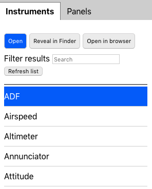
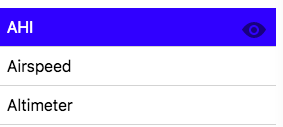
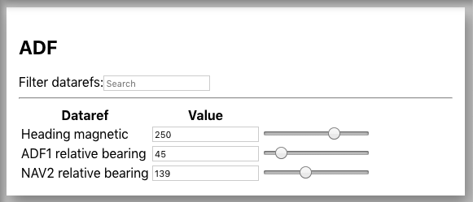
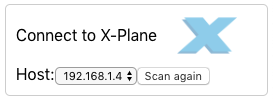
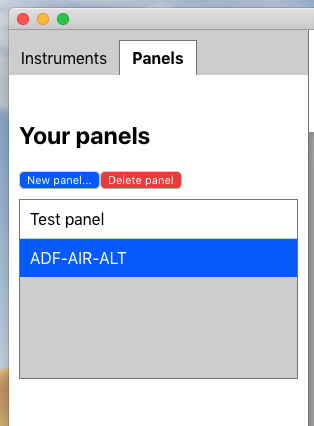
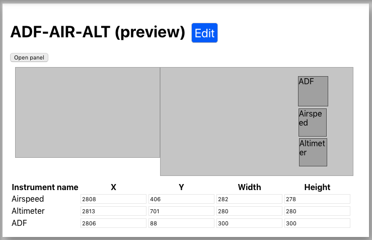
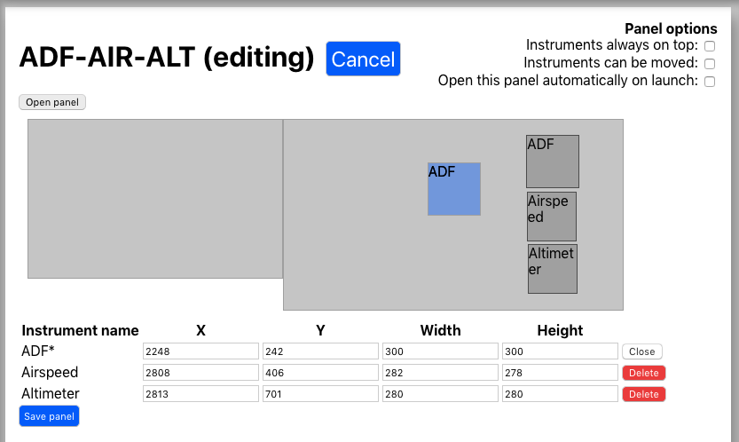
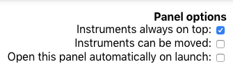
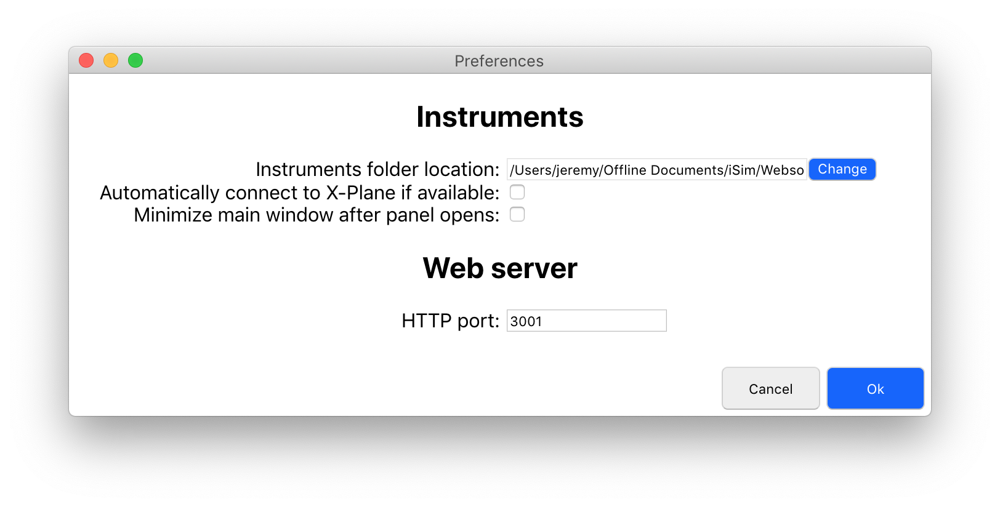

# Flight-Connect: Instruments & Panels

Flight Connect: Instruments & Panels is an application that allows you to create instrument panels with saved positions, as well as test the instruments you develop by allowing you to send your own dataref values.

## Contents

* [Instruments](#instruments)
* [The instruments list](#the-instruments-list)-
* [Opening Instruments](#opening-instruments)
* [Instrument focus](#instrument-focus)
* [Setting datarefs](#setting-datarefs)
* [Moving instrument windows](#moving-instrument-windows)
* [Closing instruments](#closing-instruments)
* [Open instrument in browser](#open-an-instrument-in-browser)
* [Show instrument in folder](#open-instrument-in-folder)
* [Open instrument on remote computer or device](#open-instrument-on-remote-computer-or-device)
* [Connecting to X-Plane](#connecting-to-x-plane)
 * [Scanning for hosts](#scanning-for-hosts)
 * [Selecting host](#selecting-a-host)
* [Panels](#panels)
 * [The panels list](#the-panels-list)-
 * [Creating a new panel](#creating-a-new-panel)
 * [Preview mode](#preview-mode)
 * [Editing mode](#editing-mode)
  - [Adding instruments to panel](#adding-instruments-to-panel)
  - [Positioning instruments](#positioning-instruments)
  - [Panel options](#panel-options)
* [Preferences](#preferences)
 * [Instruments folder location](#instruments-folder-location)-
 * [Automatically connect to X-Plane if available](#automatically-connect-to-x-plane-if-available)
 * [Minimize main window after panel opens](#minimize-main-window-after-panel-opens)
 * [HTTP port](#http-port)

## Instruments

### The instruments list
An instruments list shows the list of instruments available. All instruments should be located at "Flight-Connect-Instrument" folder. If no instruments are shown on the list (this could also happened when the folder is moved), the "Flight-Connect-Instrument" folder shall be linked by using  [Instruments folder location](#Instruments folder location)  button.   

### Opening instruments
Open an instrument by either:

* Selecting it on the instruments list and clicking Open
* Double clicking it in the sidebar

Multiple instruments can be opened at the same time. 

### Instrument focus
An instrument that is already open can be brought back into focus by double clicking on it in the sidebar or by clicking on the eye sign on the sidebar next to the respective instrument.

### Setting datarefs

When an instrument is connected, a panel will appear in the right hand area of the application. Here will be shown the instrument's name, the datarefs it is subscribed to, and the current value of that dataref, which defaults to zero.

You can set the value of the dataref by:

* Typing a value into the input box
* Using the up and down arrow keys of a focused input to increment / decrement the value.

If the dataref has an associated custom input slider or radio buttons, you can use this to adjust the value.

### Moving instrument windows
You can move an instruments window by dragging anywhere on the instrument.

**Note for developers:** For this to work, your instrument's body must have the `-webkit-app-region` css property set to `drag`. This is included in `shared.css`

### Closing instruments
An instrument window can be closed by:

* Selecting it in the instruments list panel and clicking the close button at the top of the list
* Bringing the instrument window into focus and using the ctrl+w / command+w keyboard shortcut (windows/mac)

### Open an instrument in browser

An instrument can be opened in your default web browser by selecting it in the instruments list and clicking the `Open in browser` button.

To use a browser that is not your default browser, open the instrument folder and right click the `index.html` file and use the `open with` menu to select your browser of choice.

### Open instrument in folder

To reveal and instrument in its containing folder, click the `Reveal in Finder` / `Reveal in Explorer` button (Mac / Windows).

### Open instrument on remote computer or device

To open an instrument on a different device, such as a phone, tablet or other computer, open an inetrnet browser on that device and visit the address displayed in the top panel of the app.
 
*Note: both computers/devices must be connected to the same wifi network.*

You will see a listing of the instruments available. Alternately you can visit that address with the name of the instrument as the suffix to open it directly eg. `http://192.168.1.10:3001/Altimeter`

## Connecting to X-Plane

Flight-Connect will automatically scan your local network for instances of X-Plane running the Flight-Connect plugin. If an instance is found, you will be given the option to connect. Press on `Connect to X-Plane` button on the top right corner to connect to the X-Plane. 

The instruments can connect to X-Plane automitacally by setting respective option in preferences: [Automatically connect to X-Plane if available](#Automatically connect to X-Plane if available)

### Scanning for hosts

If X-Plane is not found (or was not running) you can automatically trigger a rescan by clicking the `Scan again` button.

### Selecting a host

If more than one instance is found, you can choose between them using the drop down.

## Panels

A panel is a collection of instruments with set positions and sizes that can be opened all together. Panels can be set to open automatically when Flight-Connect launches. To view and edit your panels, select the panels tab on the left side panel. 

### The panels list

The panels list appears in the left side panel under the heading `Your panels`. It has options to create and delete panels. You can rename an existing panel by double clicking on it in the list.

### Creating a new panel

A new panel can be created by clicking the `New panel...` button at the top of the panels list.

### Preview mode

When you click on a panel in the list, you are shown a preview of the panel showing you a representation of the windows and their positions.

### Editing mode

To edit a panel, select it in the panels list and click the edit button. 

### Adding instruments to panel

To add an instrument to a panel first enter editing mode. Then open the instrument you want to add to the panel from the `Quick instruments` list on the left. Now position the instrument to where you want it to be and click `Save panel`. See the positioning instruments topic below for more details.

### Positioning instruments

You can position an instrument that is open in the following ways:

* Drag the instrument window into position.
* Select the open window in the instrument editor and use the arrow keys to move it pixel by pixel, this is great for fine adjustment. (Hold shift to move in larger jumps)
* Edit the X, Y, Width or Height properties in the table.

### Panel options

**Instruments always on top:** Instrument windows will stay on top of other windows.

**Instruments can be moved:** You can drag the instruments around when the panel is open, otherwise they're fixed in place.

**Open this panel automatically on launch:** This panel will be opened automatically when Flight-Connect launches. Coupled with the `Minimize main window after panel opens` option in the preferences menu and the `Automatically connect to X-Plane if available` option, you can have a panel that opens and connects with just one click.

## Preferences

### Instruments folder location

Click `change` to browse to the folder where you would like Flight-Connect to scan for instruments.

### Automatically connect to X-Plane if available

If Flight-Connect detects an instance of X-Plane running the Flight-Connect plugin on your local network, it will connect automatically.

### Minimize main window after panel opens

Flight-Connect will minimize the main window after it opens a panel so that it doesn't get in the way.

### HTTP port

Set the port for Flight-Connect to run its HTTP server on. Default value is 3001. It is recommended not to change this unless you know what you're doing.
