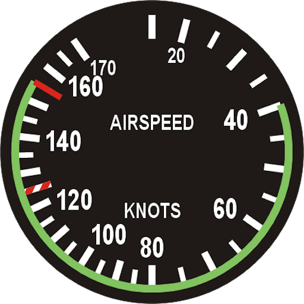
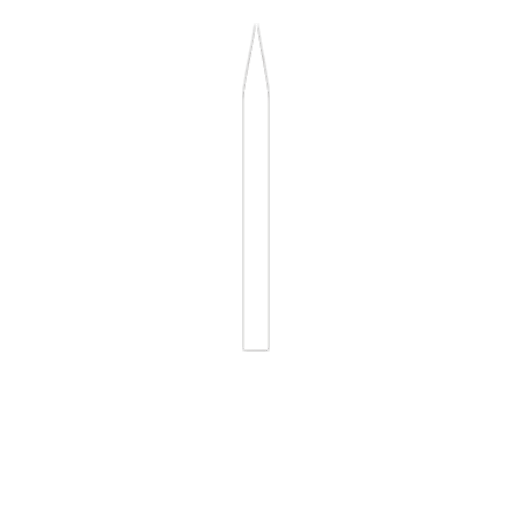
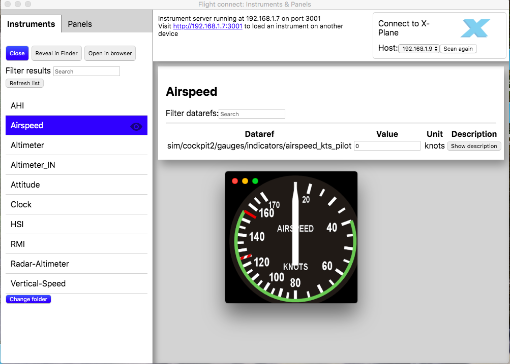
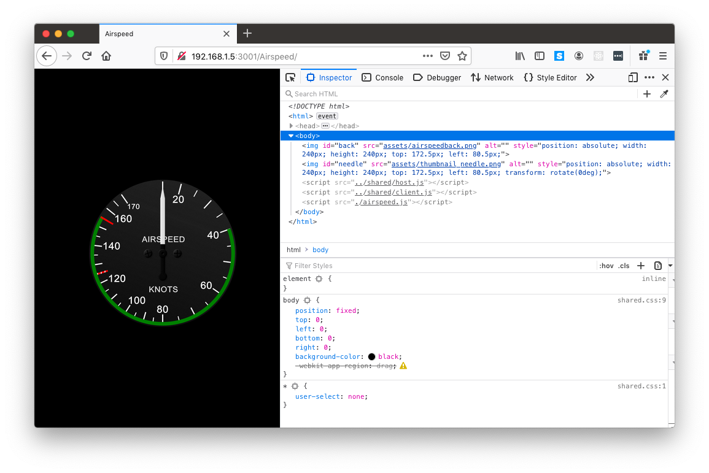
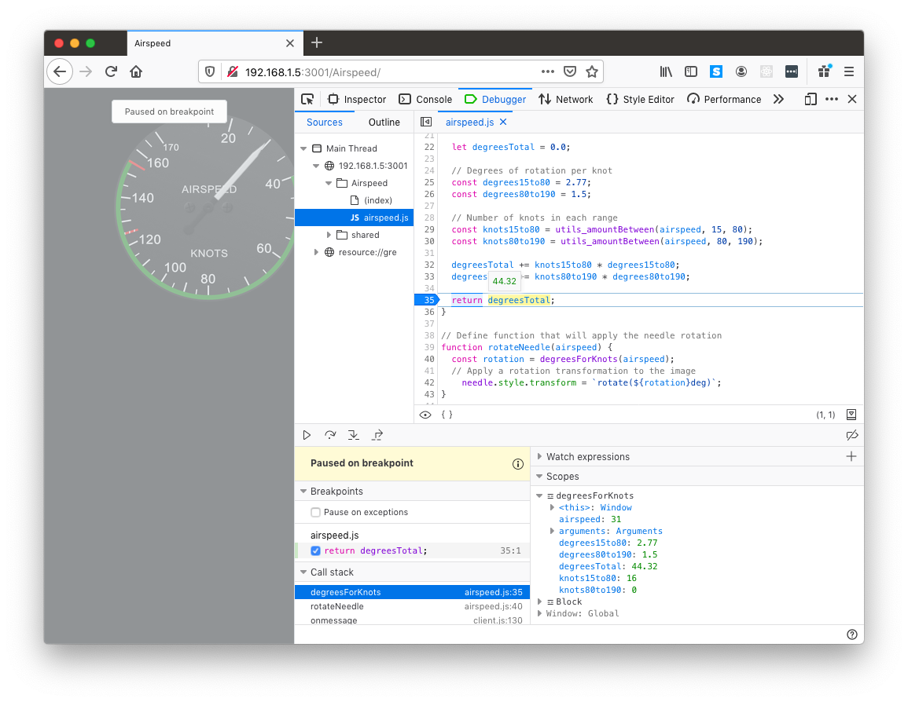
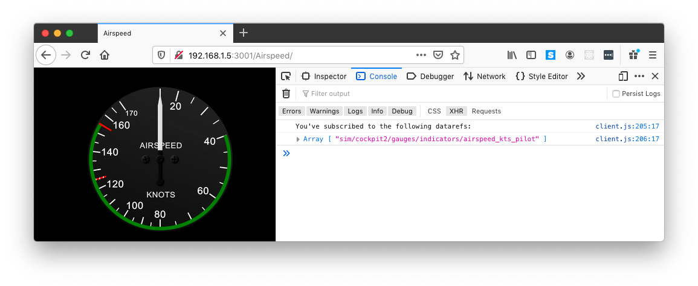

# Making your first instrument - Airspeed

This tutorial will guide you through the steps to create an airspeed indicator using Flight-Connect. The tutorial does not require any prior knowledge of HTML, CSS or Javascript, but does not go into depth on the core concepts. Here are some links to good places to start if you want to learn more.

* [Getting started with HTML](https://developer.mozilla.org/en-US/docs/Learn/HTML/Introduction_to_HTML/Getting_started)
* [CSS Basics](https://developer.mozilla.org/en-US/docs/Learn/Getting_started_with_the_web/CSS_basics)
* [Javascript basics](https://developer.mozilla.org/en-US/docs/Learn/Getting_started_with_the_web/JavaScript_basics)
* [w3schools.com](https://www.w3schools.com) a good site for reference

A video version of this tutorial is available [add link here]() if you prefer or want to follow along in tandem.

## What you need
* A text editor - I recommend [Visual Studio Code](https://code.visualstudio.com), but almost anything will work.
* A web browser - Again, any one will work, but Firefox or Chrome are preferable because of their built in developer tools.
* A copy of the Flight-Connect plugin - This tutorial will work on both the free and full editions.
* A copy of the Flight-Connect: Instruments & Panels application.

## Setting up

1. Download and install the Flight Connect application. On Windows by running the installer. On MacOS by dragging the Flight Connect app to your Applications folder.
2. Open the application. It may help to familiarise yourself with it before continuing.
3. At the bottom of the list of instruments, click the button titled `Open instruments folder`. This will open the folder where your instruments are currently living.
4. In this folder, create a folder called `Airspeed tutorial` and using your text editor, create two empty files inside it: `index.html` and `airspeed.js`

## index.html
This file contains the structure of your instrument. This is where you will add your images and also link your logic files. To edit, open `index.html` file with your text editor. 

### Header:
`index.html` contains the following code:

```html
<!DOCTYPE html>
<html>
  <head>
    <meta charset="utf-8"/>
    <title>Airspeed</title>
    <link rel="stylesheet" href="../shared/shared.css">
  </head>
  <body>
```

This gives your instrument a title and loads in some basic styling like giving your instrument window a black background.


###Body:
An airspeed indicator is a pretty simple gauge. You have a background image and a needle. Save these two images into your assets folder.

<div style="display: flex; justify-content: space-around;">
 
 
</div>


Now we can add html img tags to load these two images using the following code:

```html

  
  


```

The ```src``` property contains the path to the image, if you find the images don't load, check this or name of the image is correct.

The ```id``` property is required for later on when we want to get a references to these images from inside our Javascript logic.

### Scripts:
Our HTML needs to tell the browser what scripts to load in order for our instrument to function. 

```html
<script src="../shared/host.js"></script>
<script src="../shared/client.js"></script>
<script src="./airspeed.js"></script>
</body>
</html>
```
DO NOT CHANGE those lines unless you are familiar with html programming. The order that these scripts are loaded in is important. You should always load your custom scripts after host and client.

* **host.js** contains the address to the computer that we want to connect to. The default value is ```localhost```, meaning connect to _this_ computer. If you want to connect your instruments to Flight-Connect running on a different computer, change the ```__configuredHost``` field in ```host.js``` to the IP address of that computer.

* **client.js** contains the code that handles your instrument's connection to Flight-Connect.
* **airspeed.js** contains the code that we will write for the instrument's behaviour.
NOTE: if you rename  `aispeed.js` file to reflect your instrument name (for example to `my_airspeed.js` the name in the html script tag has to be changed accordingly. 

## airspeed.js

Add the following code to ```airspeed.js```. The code takes advantage of a number of provided utility functions, you can find their documentation [here](utils.md). For an in depth description of the AppConnection and subscribing to datarefs, refer to the documentation [here](client.md)


* Define width and height of the gauge in the window. To change instrumemnt size, simply change these number.

```javascript
const INSTRUMENT_WIDTH = 240; //px
const INSTRUMENT_HEIGHT = 240; //px
```

* Get reference to image elements. The name of the image (eg `needle` shall be the same as refered in `index.html` by id: ``

```javascript
const back = document.getElementById("back");
const needle = document.getElementById("needle");
```

* Center the images in the window

```javascript
utils_centerElement(back, INSTRUMENT_WIDTH, INSTRUMENT_HEIGHT);
utils_centerElement(needle, INSTRUMENT_WIDTH, INSTRUMENT_HEIGHT);
```

* Given an airspeed, calculate degrees of rotation for the needle.

```javascript
function degreesForKnots(airspeed) {

    let degreesTotal = 0.0;

    // Degrees of rotation per knot
    const degrees15to80 = 2.77;
    const degrees80to190 = 1.5;

    // Number of knots in each range
    const knots15to80 = utils_amountBetween(airspeed, 15, 80);
    const knots80to190 = utils_amountBetween(airspeed, 80, 190);

    degreesTotal += knots15to80 * degrees15to80;
    degreesTotal += knots80to190 * degrees80to190;

    return degreesTotal;
}
```

* Define function that will apply the needle rotation

```javascript
function rotateNeedle(airspeed) {
    const rotation = degreesForKnots(airspeed);
    // Apply a rotation transformation to the image
    needle.style.transform = `rotate(${rotation}deg)`;
}
```

* Connect to Flight-Connect. You can update the name and identifier. 

```javascript
new AppConnection(__configuredHost, { name: "Tutorial", identifier: "airspeed" }, (connection) => {
```

 
* Subscribe to X-Plane dataref `sim/cockpit2/gauges/indicators/airspeed_kts_pilot` with rotateNeedle callback/function. 
 
 ```javascript
    connection.datarefSubscribe(
        rotateNeedle, this, 
        "sim/cockpit2/gauges/indicators/airspeed_kts_pilot"
    );
});
```

You can also open your instrument in a web browser by simply double clicking your index.html file. Your instruments will still connect to Flight-Connect for setting datarefs. It is  preferable to have instruments open in a browser while developing them because of the developer tools available, see the section below on debugging.

## Testing

Refresh the list of instruments in the Flight-Connect: Instruments & Panels application and you should see your instrument appear in the list. Double click on it to open it. You should see the subscription to the airspeed dataref show up in the right side panel.



### Debugging
If you're ever having trouble while building instruments, an extremely valuable tool is your browser's developer tools. They can provide you with a number of valuable insights into your code as well as set break points and inspect the values of variables at runtime. 

The keyboard shortcut to access developer tools in most browsers is ```⌘⌥I```(```command option i```) on MacOS or ```ctrl shift i``` on Windows.

|Elements|Debugger|Console|
|---|---|---|
||||

## Understanding common error messages and problems

### ReferenceError: utils_getWindowShortestSideLength is not defined. 

Note: This applies to any other functions starting with utils_ being not defined. The cause of this error could be forgetting to load client.js, your shared folder being missing, or the link to client.js being incorrect or loading client.js after your custom scripts.

### ReferenceError: __configuredHost is not defined

You forgot to, or incorrectly loaded host.js or your shared folder is missing. This must come before client.js. See example instruments for how to do this correctly.

### My instrument doesn't respond / dataref always returns zero

The most likely cause of this is a typo in, or invalid dataref name in your subscription call. A way to debug this is to connect your instrument to the flight connect application. If it is not a recognised dataref then there will be no description or unit available.

## Connecting your instrument to X-Plane
1. Place the Flight-Connect plugin inside your X-Plane plugins directory. (```X-Plane 11/Resources/plugins```)
2. Launch X-Plane
3. Allow the Flight-Connect application to discover that X-Plane is running, or manually press the scan button.
4. Click 'Connect to X-Plane'
